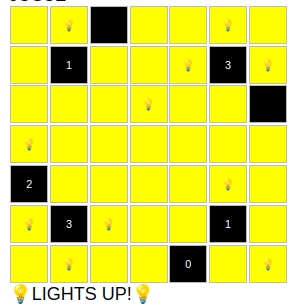

# LIGHT UP 💡

Light Up, also known as Akari, is a puzzle game originally developed by the Japanese publisher Nikoli.
The game is played on a grid containing white cells and black cells, where the player can place lamps on the white cells.
  <b>The ultimate goal is to illuminate all white cells.</b>

[Complete rules of the game can be found here](https://www.brunoribas.com.br/flia/2024-2/lightup.html).

## What's this project about? 📝

This project aims to solve Light Up puzzles using <b>PDDL (Planning Domain Description Language)</b>.
The algorithm will read the Light Up grid, translate it and execute the plan in PDDL.

## How is PDDL being executed?

In this project, PDDL files can be executed using any of the following planners:
- [Madagascar](https://research.ics.aalto.fi/software/sat/madagascar/)
- [Julia Planner](https://github.com/JuliaPlanners/PDDL.jl)
- [Fast-Downward](https://www.fast-downward.org/)